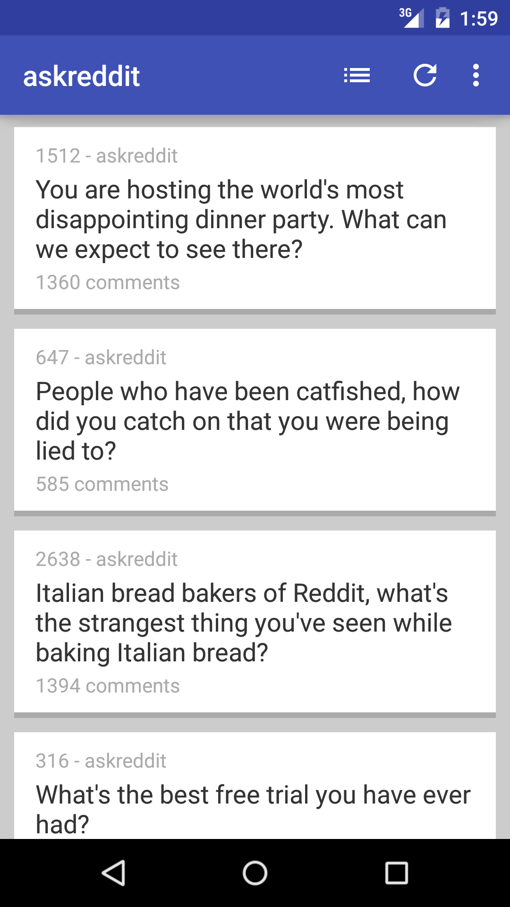

# RedditReadOnly

**A lightweight Reddit app for Android.**

Entirely read-only with no write features (upvoting, downvoting, commenting, posting, etc.)

---

**Current Features**
 - view submissions with thumbnails
 - go to submission link
 - go to comments
 - click links in comments or self-text
 - refresh submissions
 - go to a subscribed subreddit
 - get link of post on long click
 - subreddit search
 - refresh comments
 - sort by hot/top/controversial/new

**Feature Wishlist**
 - load all comments
 - improved comment formatting
 - option for dark theme
 - trending subreddits
 - gilded count display
 - abstract comment and submission views
 - custom color theme options
 - browse without logging in
 - display if post or comment has been edited
 - indicate stickied posts
 - show trending subreddits
 - allow subreddit subscription updating
 - show moderator tags on posts (I could go either way on whether including this is a good idea)

**Known Bugs**
 - crash on reauthentication
 - bestof links don't load properly
 - logout feature not fully functional
 - opening app without internet connection crashes app
 
---
 

